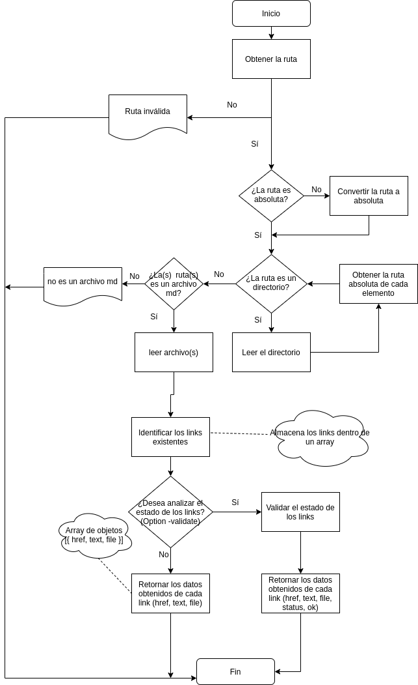

#LIBRERIA MD-LINK
## Tabla de contenidos

* [1. Resumen del proyecto](#1-Resumen-del-proyecto)
* [2. Flujograma](#2-Flujograma)
* [3. Organización](#3-Organizacion-del-proyecto)
* [4. Documentación](#4-Documentacion-de-la-libreria)
* [5. CLI](#5-CLI) 

***

## 1. Resumen del proyecto

Markdown es un lenguaje de marcado ligero muy popular entre developers. Es usado en muchísimas plataformas que manejan texto plano (GitHub, foros, blogs, ...), y es muy común encontrar varios archivos en ese formato en cualquier tipo de repositorio (empezando por el tradicional README.md).

Estos archivos Markdown normalmente contienen links (vínculos/ligas) que muchas veces están rotos o ya no son válidos y eso perjudica mucho el valor de la información que se quiere compartir.

En este proyecto el objetivo es crear una herramienta usando Node.js, que lea y analice archivos en formato Markdown, para verificar los links que contengan y reportar algunas estadísticas.

## 2. Flujograma.

## 3. Organizacion del proyecto.


## 4. Documentacion de la libreria

Para instalar md-links, debe hacer lo siguiente: 

    npm install 

Crear un archivo .js

```js
// Dentro del archivo creado, colocar
const mdLinks = require('md-links-');
 ```

## 5. API

  ### 4.1 Flujograma

  El flujograma muestra el proceso de creación del API. 


